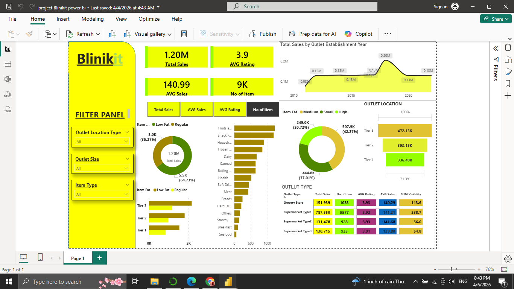

# 🛒 Blinkit Sales Analysis Dashboard (Power BI)

## 📌 Project Overview

This project presents an interactive Power BI dashboard analyzing sales data for a retail grocery business (Blinkit).

The dashboard highlights key performance indicators, sales distribution, and product insights to support business decision-making.

---

## 🎯 Objectives

* Analyze total sales and performance metrics
* Compare outlet types and sizes
* Understand product category performance
* Identify trends and patterns in sales

---

## 🛠️ Tools & Technologies

* Power BI
* DAX
* Data Modeling

---

## 📊 Dashboard Features

* 💰 Total Sales, Average Sales, and Ratings
* 📦 Item category analysis
* 🏬 Outlet size & location insights
* 🧾 Outlet type comparison
* 📈 Sales trends over time
* 🎛️ Interactive filters

---

## 📈 Key Insights

* Tier 3 outlets generate the highest revenue
* Supermarket Type1 dominates in sales and volume
* Fruits and Snacks are top-performing categories
* Sales vary significantly based on outlet size and location

---

## 📸 Dashboard Preview

---

## 📂 Project Files

* `dashboard.pbix` → Power BI file
* (Optional) dataset file

---

## 🚀 How to Use

1. Download the `.pbix` file
2. Open using Power BI Desktop
3. Interact with filters and visuals

---

## 📌 Conclusion

This dashboard demonstrates strong skills in data visualization, business intelligence, and storytelling using Power BI.
