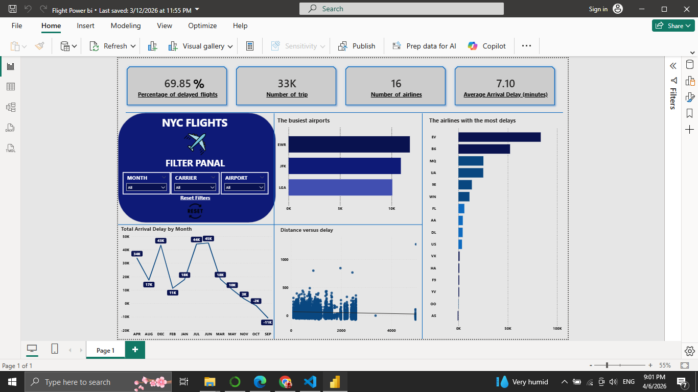

# ✈️ NYC Flights Data Analysis

## 📌 Project Overview

This project focuses on cleaning and exploring the NYC Flights dataset to understand flight behavior, delays, and airline performance.

The analysis follows a structured approach including data cleaning, exploratory data analysis (EDA), and insight extraction.

---

## 🎯 Objectives

* Understand dataset structure and features
* Handle missing values and duplicates
* Analyze departure and arrival delays
* Explore relationships between variables
* Extract meaningful business insights

---

## 🛠️ Technologies Used

* Python
* Pandas
* NumPy
* Matplotlib
* Seaborn
* Jupyter Notebook
* SQL

---

## 📂 Dataset

The dataset includes information about flights departing from NYC such as:

* Carrier (airline)
* Departure & arrival times
* Delay information
* Origin and destination

> ⚠️ Place dataset inside:

```
data/nycflights.csv
```

---

## 🧹 Data Cleaning

* Removed duplicates
* Handled missing values
* Checked data consistency
* Converted data types

---

## 📊 Exploratory Data Analysis

* Distribution of airlines and destinations
* Delay analysis (departure & arrival)
* Correlation analysis
* Grouped analysis by airline and airport

---

## 📈 Key Insights

* Strong positive relationship between departure and arrival delays
* Some airlines consistently have higher delays
* Delay-related columns contain most missing values

---

## 📸 Sample Visualization


---

## 🚀 How to Run

```bash
git clone https://github.com/your-username/Data_Analyst_Projects.git
cd NYC_Flights_Analysis
jupyter notebook
```

---

## 📌 Conclusion

This project demonstrates strong skills in data cleaning, EDA, and extracting actionable insights from real-world datasets.
