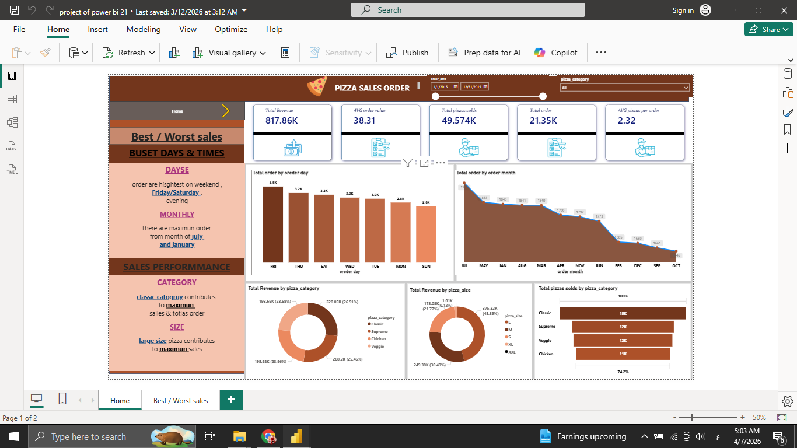
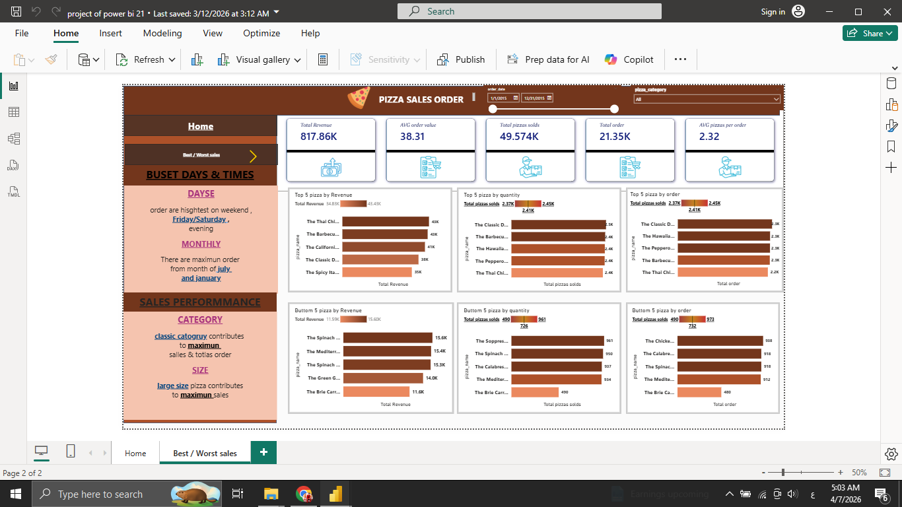

# 🍕 Pizza Sales Analysis Dashboard (Power BI)

## 📌 Project Overview

This project presents an interactive Power BI dashboard analyzing pizza sales data to uncover business insights related to revenue, orders, product performance, and customer behavior.

The dashboard is designed to help stakeholders understand sales trends and optimize decision-making.

---

## 🎯 Objectives

* Analyze total revenue and order performance
* Identify best and worst-selling pizzas
* Understand sales patterns by day and month
* Evaluate product category and size performance
* Provide actionable insights for business improvement

---

## 🛠️ Tools & Technologies

* Power BI
* DAX
* Data Modeling

---

## 📊 Dashboard Features

### 💰 Key Performance Indicators (KPIs)

* Total Revenue
* Average Order Value
* Total Orders
* Total Pizzas Sold
* Average Pizzas per Order

---

### 📅 Time-Based Analysis

* Sales distribution by **day of the week**
* Monthly sales trends
* Identification of peak sales periods

---

### 🍕 Product Analysis

* Top 5 pizzas by:

  * Revenue
  * Quantity
  * Number of orders

* Bottom 5 pizzas by:

  * Revenue
  * Quantity
  * Number of orders

---

### 🧾 Category & Size Insights

* Revenue contribution by pizza category
* Revenue distribution by pizza size
* Total pizzas sold by category

---

### 🎛️ Interactive Features

* Filters for dynamic analysis
* Drill-down capabilities
* Multi-page dashboard navigation

---

## 📈 Key Insights

* Weekends (especially Friday & Saturday evenings) have the highest order volume
* Monthly trends show peaks during specific months (e.g., July & January)
* Classic category contributes the highest revenue
* Large size pizzas generate the most sales
* Some products consistently underperform and may need optimization

---
## 📸 Sample Visualization

---

## 📂 Project Files

* `pizza_sales_dashboard.pbix` → Power BI dashboard file
* `dashboard_home.png` → Main dashboard screenshot
* `dashboard_analysis.png` → Analysis page screenshot

---

## 🚀 How to Use

1. Download the `.pbix` file
2. Open using Power BI Desktop
3. Interact with filters and visuals

---

## 💡 Business Value

This dashboard helps:

* Identify top-performing and underperforming products
* Optimize inventory and product strategy
* Improve marketing focus based on peak times
* Support data-driven decision-making

---

## 📌 Conclusion

This project demonstrates strong skills in **data visualization, business intelligence, and storytelling using Power BI**, with a focus on transforming raw data into actionable insights.
